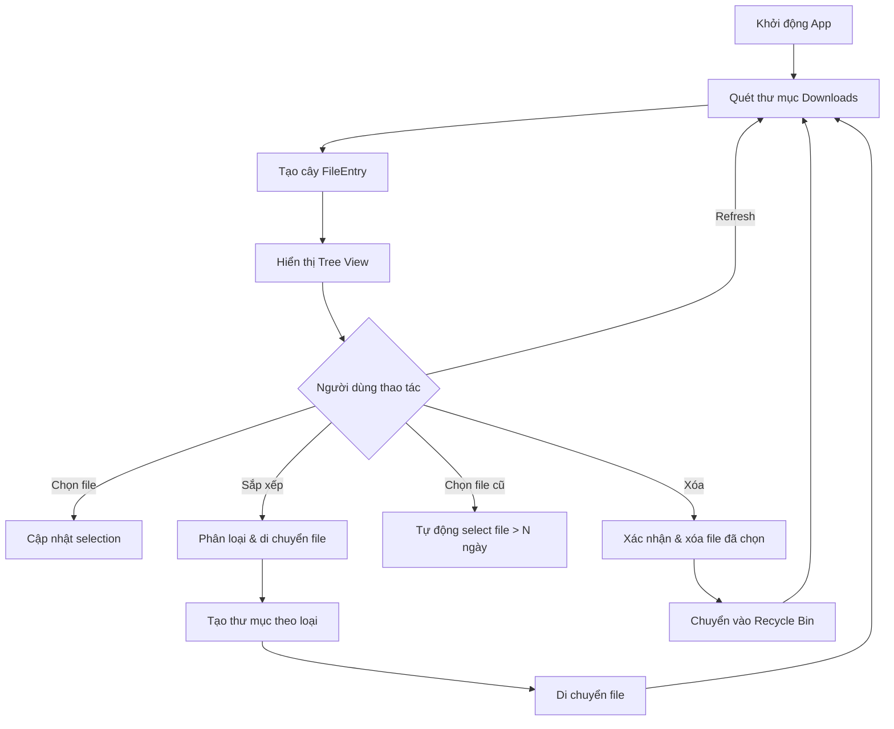

# Folder Cleaner - Tài liệu thiết kế ứng dụng

## 1. Tổng quan

**Folder Cleaner** là ứng dụng GUI viết bằng Rust, giúp người dùng quản lý và dọn dẹp thư mục Downloads một cách trực quan và hiệu quả.

### Mục tiêu chính
- Quét và hiển thị toàn bộ nội dung thư mục Downloads dưới dạng cây (tree view)
- Cung cấp thông tin chi tiết về từng file/folder
- Tự động phân loại và sắp xếp file vào các thư mục theo loại
- Phát hiện và xóa các file cũ không còn sử dụng

---

## 2. Lựa chọn thư viện GUI

### So sánh các thư viện GUI phổ biến cho Rust

| Thư viện | Giao diện | Độ khó | Native | Tree View | Ghi chú |
|----------|-----------|--------|--------|-----------|---------|
| **eframe/egui** | Modern, immediate mode | ⭐ Dễ | Cross-platform | Có (CollapsibleHeader) | Đơn giản, hiệu năng tốt, community lớn |
| iced | Elm-like, modern | ⭐⭐ Trung bình | Cross-platform | Hạn chế | API đang thay đổi nhiều |
| Slint | Declarative, modern | ⭐⭐ Trung bình | Cross-platform | Có | Cần file `.slint` riêng |
| gtk4-rs | Native GTK4 | ⭐⭐⭐ Khó | Linux native | Có (TreeView) | Cần cài GTK runtime trên Windows |
| Tauri | Web-based | ⭐⭐ Trung bình | WebView | Tùy frontend | Cần HTML/CSS/JS cho frontend |

### ✅ Đề xuất: **eframe/egui**

**Lý do chọn:**
1. **Dễ code nhất** - Immediate mode GUI, không cần quản lý state phức tạp
2. **Giao diện hiện đại** - Hỗ trợ dark/light theme, bo tròn, shadow, animation
3. **Cross-platform** - Chạy trên Windows, macOS, Linux không cần cài thêm gì
4. **Community lớn** - Tài liệu phong phú, nhiều ví dụ
5. **Hỗ trợ tree view** - `CollapsingHeader` cho phép tạo cấu trúc cây expand/collapse
6. **Hiệu năng tốt** - Render bằng GPU (wgpu/glow)
7. **Không cần runtime** - Compile thành binary duy nhất

> [!NOTE]
> egui sử dụng mô hình "immediate mode" - GUI được vẽ lại mỗi frame, code rất trực quan và dễ debug.

---

## 3. Kiến trúc ứng dụng

### Cấu trúc module

```
src/
├── main.rs              # Entry point, khởi tạo eframe app
├── app.rs               # Struct FolderCleanerApp, implement eframe::App
├── scanner.rs           # Quét thư mục, đọc metadata file
├── file_info.rs         # Struct FileEntry, lưu thông tin file/folder
├── ui/
│   ├── mod.rs           # Re-export các UI module
│   ├── tree_view.rs     # Hiển thị cây thư mục với checkbox
│   ├── toolbar.rs       # Thanh công cụ (buttons)
│   ├── file_details.rs  # Hiển thị chi tiết file (ngày tạo, size...)
│   └── dialogs.rs       # Hộp thoại xác nhận xóa, thông báo
├── actions/
│   ├── mod.rs           # Re-export
│   ├── sorter.rs        # Logic sắp xếp file theo loại
│   └── cleaner.rs       # Logic xóa file cũ, chuyển vào Recycle Bin
└── utils.rs             # Hàm tiện ích (format size, format date...)
```

### Luồng dữ liệu



---

## 4. Cấu trúc dữ liệu

### FileEntry

```rust
pub struct FileEntry {
    pub name: String,              // Tên file/folder
    pub path: PathBuf,             // Đường dẫn tuyệt đối
    pub is_dir: bool,              // Là thư mục hay file
    pub size: u64,                 // Dung lượng (bytes)
    pub created: SystemTime,       // Ngày tạo
    pub modified: SystemTime,      // Ngày chỉnh sửa
    pub accessed: SystemTime,      // Ngày truy cập gần nhất
    pub extension: Option<String>, // Phần mở rộng (pdf, jpg, zip...)
    pub selected: bool,            // Đã được chọn hay chưa
    pub expanded: bool,            // Đang mở rộng (cho folder)
    pub children: Vec<FileEntry>,  // File/folder con (nếu là thư mục)
    pub file_category: FileCategory, // Phân loại file
}
```

### FileCategory (Phân loại file)

```rust
pub enum FileCategory {
    Document,   // pdf, doc, docx, xls, xlsx, ppt, pptx, txt, csv
    Image,      // jpg, jpeg, png, gif, bmp, svg, webp, ico
    Video,      // mp4, avi, mkv, mov, wmv, flv
    Audio,      // mp3, wav, flac, aac, ogg, wma
    Archive,    // zip, rar, 7z, tar, gz, bz2
    Executable, // exe, msi, bat, cmd, ps1
    Code,       // rs, py, js, ts, html, css, java, cpp, c, h
    Other,      // Các file khác
    Folder,     // Thư mục
}
```

---

## 5. Giao diện người dùng (UI)

### Layout tổng thể

```
┌──────────────────────────────────────────────────────────┐
│  📁 Folder Cleaner                              [─][□][×]│
├──────────────────────────────────────────────────────────┤
│  [🔄 Quét lại] [📂 Sắp xếp] [🕐 Chọn file cũ ▼] [🗑 Xóa]│
│  Đường dẫn: C:\Users\xxx\Downloads                      │
├──────────────────────────────────────────────────────────┤
│                                                          │
│  ☐ 📁 Thư mục con A                     2024-01-15  45MB│
│    ├ ☑ 📄 report.pdf          2024-01-10  2024-01-15  2MB│
│    └ ☐ 🖼 image.png           2023-12-01  2023-12-01  5MB│
│  ☑ 📄 document.docx           2023-11-20  2024-01-05  1MB│
│  ☐ 📦 archive.zip             2024-01-01  2024-01-01 50MB│
│  ☑ 🎵 song.mp3                2023-10-15  2023-10-15  8MB│
│  ☐ 🎬 video.mp4               2024-01-12  2024-01-12  2GB│
│                                                          │
├──────────────────────────────────────────────────────────┤
│  Đã chọn: 3 file (11 MB) │ Tổng: 156 file (4.2 GB)     │
└──────────────────────────────────────────────────────────┘
```

### Chi tiết các thành phần UI

#### 5.1 Thanh công cụ (Toolbar)

| Nút | Icon | Chức năng |
|-----|------|-----------|
| **Quét lại** | 🔄 | Quét lại thư mục Downloads, cập nhật danh sách |
| **Sắp xếp** | 📂 | Tự động phân loại file vào thư mục theo loại |
| **Chọn file cũ** | 🕐 | Dropdown chọn khoảng thời gian (1 tháng, 2 tháng, 3 tháng, 6 tháng, 1 năm) |
| **Xóa** | 🗑 | Xóa các file đã chọn (có hộp thoại xác nhận) |

#### 5.2 Tree View (Cây thư mục)

Mỗi hàng hiển thị:

| Thành phần | Mô tả |
|------------|--------|
| ☐/☑ Checkbox | Chọn/bỏ chọn file. Chọn folder = chọn tất cả file con |
| Icon | Biểu tượng theo loại file (📁📄🖼🎵🎬📦) |
| Tên file | Tên file/folder, click vào folder để expand/collapse |
| Ngày tạo | Ngày file được tạo |
| Ngày chỉnh sửa | Lần chỉnh sửa gần nhất |
| Dung lượng | Hiển thị dạng human-readable (KB, MB, GB) |

#### 5.3 Thanh trạng thái (Status Bar)

- Số file đã chọn và tổng dung lượng đã chọn
- Tổng số file và tổng dung lượng thư mục

---

## 6. Chức năng chi tiết

### 6.1 Quét thư mục (Scanner)

- Quét đệ quy thư mục `Downloads` của user hiện tại
- Sử dụng `dirs::download_dir()` để lấy đường dẫn Downloads
- Đọc metadata: tên, kích thước, ngày tạo, ngày sửa, ngày truy cập
- Phân loại file dựa trên extension
- Xây dựng cấu trúc cây `FileEntry`

### 6.2 Sắp xếp file (Sorter)

Khi nhấn nút **Sắp xếp**, ứng dụng sẽ:

1. Tạo các thư mục con trong Downloads (nếu chưa tồn tại):
   ```
   Downloads/
   ├── Documents/    (pdf, doc, docx, xls, xlsx, ppt, txt, csv...)
   ├── Images/       (jpg, png, gif, bmp, svg, webp...)
   ├── Videos/       (mp4, avi, mkv, mov...)
   ├── Music/        (mp3, wav, flac, aac...)
   ├── Archives/     (zip, rar, 7z, tar, gz...)
   ├── Programs/     (exe, msi, bat...)
   └── Others/       (các file không thuộc nhóm trên)
   ```

2. Di chuyển các file (không phải thư mục) vào thư mục tương ứng
3. Nếu file trùng tên, thêm suffix `_1`, `_2`...
4. Hiển thị hộp thoại xác nhận trước khi di chuyển
5. Sau khi hoàn tất, tự động quét lại

### 6.3 Chọn file cũ (Old File Selector)

Khi nhấn nút **Chọn file cũ**:

1. Hiển thị dropdown chọn khoảng thời gian:
   - 1 tháng (mặc định)
   - 2 tháng
   - 3 tháng
   - 6 tháng
   - 1 năm
2. Tự động chọn (tick checkbox) tất cả file có `modified` date cũ hơn khoảng thời gian đã chọn
3. Người dùng có thể bỏ chọn thủ công nếu muốn giữ lại file nào
4. Nhấn nút **Xóa** để xóa các file đã chọn

### 6.4 Xóa file (Cleaner)

Khi nhấn nút **Xóa**:

1. Hiển thị hộp thoại xác nhận: danh sách file sẽ xóa + tổng dung lượng
2. Nếu xác nhận:
   - Chuyển file vào **Recycle Bin** (không xóa vĩnh viễn) sử dụng crate `trash`
   - Hiển thị progress bar nếu có nhiều file
3. Sau khi hoàn tất, tự động quét lại và cập nhật giao diện

> [!IMPORTANT]
> File sẽ được chuyển vào Recycle Bin thay vì xóa vĩnh viễn để đảm bảo an toàn cho người dùng.

---

## 7. Dependencies (Cargo.toml)

```toml
[dependencies]
eframe = "0.31"           # GUI framework (bao gồm egui + native backend)
dirs = "6"                # Lấy đường dẫn Downloads của user
chrono = "0.4"            # Xử lý thời gian, format ngày tháng
trash = "5"               # Chuyển file vào Recycle Bin (cross-platform)
open = "5"                # Mở file/folder bằng ứng dụng mặc định
serde = { version = "1", features = ["derive"] } # Serialize/Deserialize config
serde_json = "1"          # Lưu/đọc config dạng JSON
rfd = "0.15"              # Native file dialog (chọn thư mục)
```

---

## 8. Giao diện chi tiết - Thiết kế UI

### Theme & Màu sắc

- **Dark mode** mặc định (egui Visuals::dark())
- Màu accent: `#4FC3F7` (xanh dương nhạt) cho các nút chính
- Màu cảnh báo: `#FF7043` (cam đỏ) cho nút xóa
- Màu thành công: `#66BB6A` (xanh lá) cho thông báo hoàn tất
- Font: Sử dụng font mặc định của egui, có hỗ trợ Unicode

### Responsive

- Cửa sổ mặc định: 1000x700 pixels
- Có thể resize, minimum: 800x500
- Thanh cuộn (scroll) tự động khi danh sách file dài
- Cột thông tin file có chiều rộng cố định, tên file tự expand

---

## 9. Xử lý lỗi & Edge cases

| Trường hợp | Xử lý |
|-------------|--------|
| Thư mục Downloads không tồn tại | Hiển thị thông báo lỗi, cho phép chọn thư mục khác |
| File bị khóa (đang sử dụng) | Bỏ qua file đó, hiển thị danh sách file không thể xóa |
| Không đủ quyền truy cập | Hiển thị cảnh báo, bỏ qua file/folder đó |
| Thư mục rỗng | Hiển thị thông báo "Thư mục trống" |
| File trùng tên khi sắp xếp | Thêm suffix `_1`, `_2`... |
| Quá nhiều file (>10000) | Hiển thị cảnh báo, quét với giới hạn depth |

---

## 10. Tính năng mở rộng (tương lai)

- [ ] Hỗ trợ quét nhiều thư mục (không chỉ Downloads)
- [ ] Lưu cấu hình người dùng (thư mục quét, khoảng thời gian mặc định)
- [ ] Tìm kiếm file theo tên
- [ ] Phát hiện file trùng lặp (duplicate finder)
- [ ] Lịch sử thao tác (undo/redo)
- [ ] Tự động dọn dẹp theo lịch (scheduled cleanup)
- [ ] Hiển thị biểu đồ phân bố dung lượng theo loại file
- [ ] Hỗ trợ đa ngôn ngữ (i18n)
