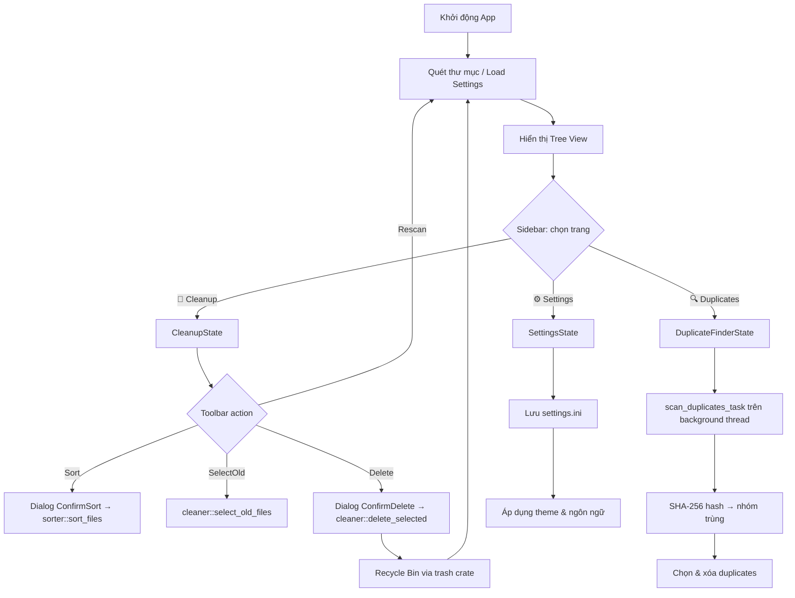

# Folder Cleaner - Tài liệu thiết kế ứng dụng

## 1. Tổng quan

**Folder Cleaner** là ứng dụng GUI viết bằng Rust, giúp người dùng quản lý và dọn dẹp thư mục một cách trực quan và hiệu quả. Hỗ trợ giao diện **Tiếng Việt / English**.

### Mục tiêu chính
- Quét và hiển thị toàn bộ nội dung thư mục dưới dạng cây (tree view)
- Cung cấp thông tin chi tiết về từng file/folder (tên, kích thước, ngày tạo, ngày sửa)
- Tự động phân loại và sắp xếp file vào các thư mục theo loại
- Phát hiện và xóa các file cũ không còn sử dụng
- Tìm và xóa file trùng lặp (duplicate finder)

---

## 2. Lựa chọn thư viện GUI

### ✅ eframe/egui v0.33

**Lý do chọn:**
1. **Immediate mode GUI** — không cần quản lý state phức tạp
2. **Cross-platform** — Windows, macOS, Linux không cần cài runtime
3. **GPU rendering** — hiệu năng tốt với wgpu/glow
4. **Binary duy nhất** — không cần cài thêm dependency khi deploy

> [!NOTE]
> egui sử dụng mô hình "immediate mode" — GUI được vẽ lại mỗi frame, code rất trực quan và dễ debug.

---

## 3. Kiến trúc ứng dụng

### Cấu trúc module

```
src/
├── main.rs                    # Entry point, khởi tạo eframe (960×640)
├── app.rs                     # FolderCleanerApp: setup font/style, route page
├── scanner.rs                 # Quét thư mục đệ quy, đọc metadata
├── file_info.rs               # FileEntry, FileCategory, SortCriteria/State
├── lang.rs                    # Hệ thống đa ngôn ngữ (Language enum + Lang struct)
├── utils.rs                   # format_size(), format_date()
├── ui/
│   ├── mod.rs                 # pub mod colors, components, pages, theme
│   ├── colors.rs              # Hàm màu động theo dark/light mode
│   ├── theme.rs               # Design tokens (Theme struct + DEFAULT const)
│   ├── components/
│   │   ├── sidebar.rs         # Sidebar điều hướng 3 trang (icon + label)
│   │   ├── toolbar.rs         # Toolbar actions: Rescan, Sort, SelectOld, Delete
│   │   ├── tree_view.rs       # Cây file có checkbox, sort header, expand/collapse
│   │   └── dialogs.rs         # Dialog: ConfirmDelete, ConfirmSort, Processing, Result
│   └── pages/
│       ├── cleanup.rs         # Trang dọn dẹp chính (CleanupState + render)
│       ├── duplicate_finder.rs# Trang tìm file trùng (DuplicateFinderState + render)
│       └── settings.rs        # Trang cài đặt: theme, ngôn ngữ (SettingsState + render)
└── actions/
    ├── cleaner.rs             # Xóa file vào Recycle Bin (thread + progress)
    ├── sorter.rs              # Sắp xếp file theo loại vào thư mục con
    └── duplicates.rs          # (Helper) logic duplicate
```

### Luồng dữ liệu



---

## 4. Cấu trúc dữ liệu

### FileEntry (`src/file_info.rs`)

```rust
pub struct FileEntry {
    pub name: String,
    pub path: PathBuf,
    pub is_dir: bool,
    pub size: u64,
    pub created: Option<SystemTime>,
    pub modified: Option<SystemTime>,
    pub accessed: Option<SystemTime>,
    pub selected: bool,
    pub expanded: bool,
    pub children: Vec<FileEntry>,
    pub category: FileCategory,
}
```

Các method quan trọng: `total_size()`, `total_files()`, `count_selected()`, `selected_size()`, `set_selected_recursive()`, `sort_recursive()`.

### FileCategory (`src/file_info.rs`)

| Category | Extensions | Icon | Thư mục đích |
|----------|-----------|------|-------------|
| Document | pdf, doc, docx, xls, xlsx, ppt, txt, csv, odt… | 📄 | `Documents/` |
| Image | jpg, png, gif, bmp, svg, webp, tiff, psd, ai… | 🖼 | `Images/` |
| Video | mp4, avi, mkv, mov, wmv, flv, webm… | 🎬 | `Videos/` |
| Audio | mp3, wav, flac, aac, ogg, wma, m4a, opus | 🎵 | `Music/` |
| Archive | zip, rar, 7z, tar, gz, bz2, xz, iso, cab | 📦 | `Archives/` |
| Executable | exe, msi, bat, cmd, ps1, com, scr | ⚙ | `Programs/` |
| Code | rs, py, js, ts, html, css, java, cpp, json, yaml… | 💻 | `Code/` |
| Other | (mọi extension còn lại) | 📎 | `Others/` |
| Folder | — | 📁 | — |

### SortState (`src/file_info.rs`)

```rust
pub struct SortState {
    pub criteria: SortCriteria, // Name | Created | Modified | Size
    pub direction: SortDirection, // Asc | Desc
}
```

Chu kỳ sort khi click header: **Asc → Desc → None (mặc định A-Z)**.

---

## 5. Hệ thống đa ngôn ngữ (`src/lang.rs`)

### Thiết kế

```rust
pub enum Language { Vietnamese, English }

pub struct Lang {
    pub nav_cleanup: &'static str,
    pub cleanup_title: &'static str,
    // ... ~70 chuỗi UI
}

pub const VI: Lang = Lang { cleanup_title: "🧹 Công Cụ Dọn Dẹp", ... };
pub const EN: Lang = Lang { cleanup_title: "🧹 Cleanup Tool", ... };
```

### Hoạt động

1. `SettingsState` lưu `language: Language` (đọc/ghi `settings.ini`)
2. `app.rs` gọi `let lang = settings_state.language.strings()` mỗi frame
3. `&lang` được truyền vào tất cả render functions — toàn bộ UI cập nhật ngay lập tức
4. **Không cần restart** app khi đổi ngôn ngữ

### Lưu trữ (`settings.ini`)

```ini
theme=Dark
language=Vietnamese
```

---

## 6. Design Token System (`src/ui/theme.rs`)

Tất cả magic number UI được tập trung tại `theme::DEFAULT`:

```rust
pub const DEFAULT: Theme = Theme {
    // Spacing: space_xs(2) → space_xxl(40)
    // Button: btn_height(32), btn_width_sm/md/lg/xl(80/100/120/160)
    // Radius: radius_sm(6), radius_md(10), radius_lg(12)
    // Font: font_sm(14) → font_heading(24)
    // Sidebar: sidebar_width(72), sidebar_item_height(60)
    // Tree: tree_row_height(28), tree_date_col(140), ...
    // Dialog: dialog_delete_min_width(350), ...
};
```

**Helper functions:** `corner_radius(u8)`, `padding(i8)`, `btn_size(f32)`, `dialog_btn_size(f32)`.

---

## 7. Giao diện người dùng (UI)

### Layout tổng thể

```
┌─────┬───────────────────────────────────────────────────────┐
│  🧹 │  🧹 Công Cụ Dọn Dẹp                                  │
│  🔍 ├──────────────────────────────────────────────────────│
│  ⚙  │  Thư mục: C:\Users\xxx\Downloads    [Đổi thư mục]   │
│     ├──────────────────────────────────────────────────────│
│     │  [Quét lại] [Sắp xếp] [Chọn file cũ ▼] [Xóa (N)]  │
│     ├──────────────────────────────────────────────────────│
│ 72px│  ☐  Tên                  Ngày tạo   Ngày sửa   Size │
│     │  ─────────────────────────────────────────────────── │
│     │  ☐ 📁 Thư mục con                          45 MB    │
│     │    ☑ 📄 report.pdf   2024-01-10  2024-01-15   2 MB  │
│     │  ☑ 📄 document.docx  2023-11-20  2024-01-05   1 MB  │
│     │  ☐ 📦 archive.zip    2024-01-01  2024-01-01  50 MB  │
│     ├──────────────────────────────────────────────────────│
│     │  Đã chọn: 2 file (3 MB) │ Tổng: 156 file (4.2 GB)  │
└─────┴───────────────────────────────────────────────────────┘
  Sidebar (72px)            Central Panel
```

### Sidebar

- 3 trang: **Cleanup** (🧹) · **Duplicate Finder** (🔍) · **Settings** (⚙)
- Icon size: 22px · Label size: 11px · Item height: 60px
- Active indicator: đường viền 3px bên trái màu accent
- Font: Segoe UI + Segoe UI Emoji (fallback để hiển thị emoji mới)

### Tree View (`src/ui/components/tree_view.rs`)

| Cột | Width | Mô tả |
|-----|-------|-------|
| Checkbox | 30px | Chọn/bỏ chọn. Folder chọn → chọn đệ quy con |
| Tên | Dynamic | Icon + tên. Folder: click arrow để expand/collapse |
| Ngày tạo | 140px | `format_date()` |
| Ngày sửa | 140px | `format_date()` |
| Dung lượng | 90px | `format_size()` — right-aligned |

Click header → sort (Asc → Desc → None). Double-click file → mở bằng app mặc định.

### Các Dialog

| Dialog | Trigger | Nội dung |
|--------|---------|---------|
| `ConfirmDelete` | Nút Xóa | Số file + tổng dung lượng + ghi chú Recycle Bin |
| `ConfirmSort` | Nút Sắp xếp | Danh sách thư mục sẽ tạo |
| `Processing` | Sau confirm | Progress bar + tên file đang xử lý |
| `ResultMessage` | Hoàn tất | Số file thành công / danh sách lỗi |

---

## 8. Chức năng chi tiết

### 8.1 Quét thư mục (`src/scanner.rs`)

- Quét đệ quy từ thư mục được chọn (mặc định `Downloads`)
- Đọc metadata: tên, kích thước, ngày tạo/sửa/truy cập
- Phân loại file theo extension → `FileCategory`
- Trả về `Vec<FileEntry>` (cấu trúc cây)

### 8.2 Sắp xếp file (`src/actions/sorter.rs`)

1. Hiển thị `ConfirmSort` dialog trước
2. Tạo thư mục con (Documents/, Images/…) nếu chưa có
3. Di chuyển file (nếu có selection → chỉ file đã chọn; không có → tất cả file)
4. Xử lý file trùng tên: thêm suffix `_1`, `_2`…
5. Quét lại sau khi hoàn tất

### 8.3 Chọn file cũ (`src/actions/cleaner.rs` — `select_old_files`)

ComboBox chọn khoảng thời gian → tự động tick tất cả file có `modified` cũ hơn N ngày.

| Lựa chọn | Ngày |
|----------|------|
| 1 tháng | 30 |
| 2 tháng | 60 |
| 3 tháng | 90 |
| 6 tháng | 180 |
| 1 năm | 365 |

### 8.4 Xóa file (`src/actions/cleaner.rs` — `delete_selected_files`)

- Chạy trên **background thread** với `std::sync::mpsc` channel
- Progress cập nhật real-time qua `progress_rx`
- Sử dụng crate `trash` → file vào **Recycle Bin** (không xóa vĩnh viễn)
- Hiển thị danh sách file thất bại nếu có lỗi

> [!IMPORTANT]
> File luôn được chuyển vào Recycle Bin, không bao giờ xóa vĩnh viễn.

### 8.5 Tìm file trùng (`src/ui/pages/duplicate_finder.rs`)

1. Thu thập tất cả file đệ quy (bỏ qua file 0 byte)
2. Nhóm theo **kích thước** → loại bỏ file unique size
3. Tính **SHA-256 hash** cho các file cùng size → nhóm trùng thực sự
4. Chạy hoàn toàn trên **background thread**, UI cập nhật qua channel
5. Giao diện hiển thị theo nhóm, cho phép chọn file cần xóa
6. **Quick Select**: tự động chọn tất cả trừ file đầu tiên mỗi nhóm

---

## 9. Dependencies

| Crate | Version | Mục đích |
|-------|---------|---------|
| `eframe` | 0.33.3 | GUI framework (egui + native backend) |
| `dirs` | 6 | Lấy đường dẫn Downloads |
| `chrono` | 0.4 | Format ngày tháng |
| `trash` | 5 | Chuyển file vào Recycle Bin |
| `open` | 5 | Mở file bằng ứng dụng mặc định |
| `rfd` | 0.17.2 | Native folder picker dialog |
| `sha2` | 0.10.9 | SHA-256 hash cho duplicate finder |
| `hex` | 0.4.3 | Encode hash bytes → hex string |
| `embed-resource` | 3.0.6 | Nhúng icon vào file .exe (build-dep) |

**Release profile:** `opt-level=3`, `lto=true`, `strip=true` — binary nhỏ gọn, hiệu năng cao.

---

## 10. Xử lý lỗi & Edge cases

| Trường hợp | Xử lý |
|-------------|--------|
| Thư mục không tồn tại | Cho phép đổi thư mục qua nút "Đổi thư mục" |
| File bị khóa khi xóa | Bỏ qua, hiển thị trong danh sách lỗi |
| Không đủ quyền truy cập | Bỏ qua file/folder đó khi quét |
| Thư mục rỗng | Hiển thị trạng thái empty với hướng dẫn |
| File trùng tên khi sắp xếp | Thêm suffix `_1`, `_2`… |
| Lỗi khi tính hash | Bỏ qua file đó trong duplicate check |

---

## 11. Cấu hình (`settings.ini`)

File lưu cạnh `.exe`, tự tạo nếu chưa có:

```ini
theme=System    # System | Light | Dark
language=Vietnamese   # Vietnamese | English
```

---

## 12. Tính năng đã triển khai

- [x] Quét thư mục đệ quy với tree view
- [x] Checkbox chọn file/folder đệ quy
- [x] Sort theo tên / ngày tạo / ngày sửa / dung lượng (Asc/Desc/None)
- [x] Sắp xếp file theo loại vào thư mục con
- [x] Chọn & xóa file cũ theo khoảng thời gian
- [x] Xóa an toàn qua Recycle Bin với progress
- [x] Tìm file trùng lặp bằng SHA-256
- [x] Đa ngôn ngữ: Tiếng Việt / English
- [x] Giao diện Dark / Light / System theme
- [x] Design token system tập trung (`theme.rs`)
- [x] Chọn thư mục quét tùy ý (không chỉ Downloads)
- [x] Đổi thư mục không cần restart

## 13. Tính năng tương lai

- [ ] Tìm kiếm file theo tên
- [ ] Lịch sử thao tác (undo/redo)
- [ ] Tự động dọn dẹp theo lịch
- [ ] Biểu đồ phân bố dung lượng theo loại file
- [ ] Hỗ trợ quét nhiều thư mục đồng thời
